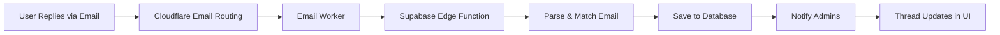

# Contact Form System Documentation

## Overview
The contact form system provides a comprehensive solution for managing user inquiries, bug reports, and feature requests with full conversation threading capabilities.

## Database Schema

### contact_form_settings
- `id` - UUID primary key
- `is_enabled` - Boolean (show/hide form)
- `title` - Text (form heading)
- `description` - Text (form subheading)
- `recipient_email` - Text (where notifications are sent)
- `reply_from_email` - Text (email address replies come from)
- `reply_from_name` - Text (sender name for replies)
- `success_message` - Text (shown after submission)
- `created_at`, `updated_at` - Timestamps

### contact_form_submissions
- `id` - UUID primary key
- `name` - Text (required)
- `email` - Text (required)
- `subject` - Text (optional)
- `message` - Text (required)
- `message_type` - Text (general | bug_report | feature_request)
- `image_url` - Text (optional attachment)
- `status` - Text (new | read | backlog | in_progress | done | wont_fix)
- `assigned_to` - UUID (admin user this message is assigned to, nullable)
- `replied_at` - Timestamp (first reply time)
- `replied_by` - UUID (admin who first replied)
- `reply_message` - Text (first reply message for backward compatibility)
- `admin_notes` - Text (internal notes)
- `created_at` - Timestamp

### Message Assignment Feature
**Purpose:** Allow admins to assign messages to specific team members for handling

**Behavior:**
- Messages can be assigned to any admin/owner user
- The notification badge count only shows messages that are:
  - Unassigned (visible to all admins), OR
  - Assigned to the current admin user
- When a message is assigned to another admin, it no longer contributes to other admins' badge counts
- Assignment can be changed from the list view (dropdown menu) or detail dialog
- Clicking the assigned badge in the list view unassigns the message

### contact_form_replies (NEW - Added 2025-01-14)
**Purpose:** Store threaded conversation history for back-and-forth communication

- `id` - UUID primary key
- `submission_id` - UUID (references contact_form_submissions)
- `sender_type` - Text ('admin' | 'user')
- `sender_id` - UUID (references auth.users, null for user replies)
- `sender_name` - Text
- `sender_email` - Text
- `message` - Text
- `created_at` - Timestamp

**Migration:** Existing replies from `contact_form_submissions.reply_message` were automatically migrated to this table

## Edge Functions

### send-contact-reply
**Purpose:** Send reply email and save to conversation thread

**Input:**
```typescript
{
  submissionId: string (uuid),
  replyMessage: string (1-5000 chars),
  adminNotes?: string (max 1000 chars)
}
```

**Process:**
1. Validate input with Zod schema
2. Verify admin authorization
3. Fetch submission details
4. Get admin profile for signature
5. Build HTML email with app branding
6. Send email via Resend
7. **Save reply to `contact_form_replies` table**
8. Update admin notes if provided
9. Trigger updates submission table (replied_at, status)

**Security:**
- Requires authentication
- Admin/owner role verified
- HTML sanitization for reply message
- Input validation (Zod)

### notify-admin-new-contact
**Purpose:** Send notification email to ALL admins/owners when new submission arrives

**Trigger:** Automatic on contact form submission

**Multi-Recipient Support (Added 2025-01-15):**
- Fetches `recipient_email` from `contact_form_settings` table
- Fetches ALL users with 'admin' or 'owner' role from `user_roles` table
- Gets email addresses from `profiles` table for those users
- Deduplicates and sends to all recipients in a single email
- Falls back to `ADMIN_EMAIL` env var if no recipients configured

**Process:**
1. Fetch submission by ID or latest by email
2. Get settings email from `contact_form_settings.recipient_email`
3. Get all admin/owner user IDs from `user_roles`
4. Get emails from `profiles` table for those users
5. Combine and deduplicate all recipient emails
6. Build HTML email with no-reply warning banners
7. Send to all recipients via Resend
8. Log to `email_audit_log` with all recipients listed

## Frontend Components

### ContactForm
**Location:** Site footer (all pages when enabled)

**Features:**
- Auto-loads settings from database
- Client-side validation (Zod)
- Message type selection
- Optional image upload
- Optional subject line
- Graceful email handling

### ContactSubmissions (ContactFormManager)
**Location:** Admin > Contact tab

**Overview:** 
The ContactSubmissions component provides a comprehensive interface for managing all contact form submissions and email conversations in a unified modal experience. The design prioritizes quick access to conversations while keeping less common actions organized in a dropdown menu.

**UI Layout:**

#### Table Columns
1. **Checkbox** - Bulk selection
2. **Status Indicator** - Red dot for new messages or unread replies
3. **Date** - Numeric format (M/d/yy) for space efficiency
4. **Name** - Sender's name
5. **Subject** - Message subject (truncated at 200px, full text on hover)
6. **Type** - Badge showing message_type (general, bug_report, feature_request)
7. **Source** - Icon indicator (Mail for email, Globe for web form)
8. **Status** - Badge (new/read)
9. **Actions** - Primary Reply button + More dropdown

#### Action Buttons
**Primary Action - Reply Button:**
- Always visible and prominent
- Icon: `Reply`
- Opens unified conversation modal
- Shows red badge with count if unread replies exist
- Tooltip: "View and reply"

**Secondary Actions - More Dropdown:**
- Icon: `MoreVertical` (three dots)
- Contains:
  - **View Message** - Opens conversation modal (same as Reply button)
  - **Mark as Read/Unread** - Toggles submission status
  - **Delete** - Removes submission (red text)

#### Bulk Actions Bar
**Appears when one or more submissions selected:**
- Shows count: "{n} selected"
- **Mark as Read** button - Batch status update
- **Delete** button - Batch deletion (with confirmation)

#### Unified Conversation Modal
**Opens on:** Row click, Reply button click, or View Message from dropdown

**Modal Structure:**
1. **Header**
   - Title: "Message from {name}"
   - Description: Sender's email

2. **Content Area (Scrollable)**
   
   **Section A: Original Message**
   - Background: `bg-muted/50` with rounded corners
   - Date + Status badge (top right)
   - Subject line (if present)
   - Message text (whitespace preserved, styled box)
   - Image attachment (if present, full size with border)
   
   **Section B: Conversation History** (if replies exist)
   - Heading: "Conversation History"
   - Scrollable container (max-height: 240px)
   - Messages styled by sender type:
     - Admin replies: `bg-primary/10 ml-8` (indented right)
     - User replies: `bg-muted mr-8` (indented left)
   - Each message shows:
     - Sender name + type badge
     - Timestamp (formatted with date-fns)
     - Message content (whitespace preserved)
   - Loading spinner while fetching replies
   
   **Section C: Reply Form** (always visible)
   - Separator: Border-top with padding
   - Heading: "Send Reply"
   - **Reply Message Textarea**
     - Placeholder: "Type your reply..."
     - Rows: 6
     - Required for submission
   - **Admin Notes Textarea**
     - Placeholder: "Admin notes (internal only)..."
     - Rows: 3
     - Optional, not sent to user
   - **Send Reply Button**
     - Icon: `Reply`
     - Text: "Send Reply"
     - Disabled if reply message empty or sending
     - Shows spinner + "Sending..." during submission

3. **Modal Behavior**
   - Max width: 768px (3xl)
   - Max height: 90vh
   - Content area uses flexbox with scroll
   - Padding on right for scrollbar (pr-2)
   - Closes automatically after reply sent
   - Marks related notifications as read on open
   - Loads conversation history on open

**Features:**
- ✅ **Unified View+Reply** - See full message and reply in same modal
- ✅ **Threaded Conversations** - All replies displayed chronologically
- ✅ **Full Context** - Original message always visible when replying
- ✅ **Scrollable Content** - Large images and long conversations handled gracefully
- ✅ **Real-time Updates** - Automatic refresh on database changes
- ✅ **Bulk Operations** - Multi-select for batch status changes and deletions
- ✅ **Badge Indicators** - Red dot for new/unread, count badge for unread replies
- ✅ **Smart Notifications** - Auto-clear when opening conversation
- ✅ **Email Integration** - Supports both web form and email routing sources
- ✅ **Admin Notes** - Internal notes separate from customer-facing replies
- ✅ **Status Management** - Easy toggle between new/read states
- ✅ **Compact Design** - Numeric dates and truncated subjects save space

**State Management:**
```typescript
// Single dialog state for unified modal
const [dialogOpen, setDialogOpen] = useState(false);
const [selectedSubmission, setSelectedSubmission] = useState<Submission | null>(null);
const [replyMessage, setReplyMessage] = useState("");
const [adminNotes, setAdminNotes] = useState("");
const [replies, setReplies] = useState<Reply[]>([]);
const [loadingReplies, setLoadingReplies] = useState(false);
const [sending, setSending] = useState(false);
```

**Performance Optimizations:**
- Single query fetches all reply counts for entire page
- Client-side filtering with JavaScript Map
- Realtime subscriptions with debounced updates
- Parallel data loading (submissions + replies)

## UI Design Patterns

### Unified Modal Pattern (2025-11-04 Update)

**Philosophy:** Combine viewing and replying into a single seamless experience rather than forcing users to switch between separate dialogs.

**Benefits:**
- Reduces cognitive load (one modal vs. two)
- Maintains context (message always visible when replying)
- Faster workflow (no modal switching)
- Better for threaded conversations (see full history + compose reply)
- Improved accessibility (single focus trap)

**Implementation:**
```typescript
// BEFORE (Separated)
const [viewDialogOpen, setViewDialogOpen] = useState(false);
const [replyDialogOpen, setReplyDialogOpen] = useState(false);

// AFTER (Unified)
const [dialogOpen, setDialogOpen] = useState(false);
```

### Conversation Threading System

**Visual Hierarchy:**

1. **Original Message (Top)**
   - Muted background to differentiate from replies
   - All metadata visible (date, status, subject)
   - Full message content preserved
   - Image attachments displayed inline

2. **Conversation History (Middle)**
   - Chronological display (oldest to newest)
   - Color coding by sender type:
     - Admin: Primary tint, right-aligned
     - User: Muted background, left-aligned
   - Timestamp on each message
   - Sender name + type badge
   - Scrollable if many replies

3. **Reply Form (Bottom)**
   - Always visible (no scrolling needed)
   - Clear visual separator (border-top)
   - Two textareas (public reply + private notes)
   - Prominent send button

### Action Button Hierarchy

**Primary Actions:**
- Most common action: Reply button
- Always visible, never in dropdown
- Shows state (unread count badge)

**Secondary Actions:**
- Less frequent actions: More dropdown
- Keeps interface clean
- Organized by function:
  1. View (same as primary but in menu)
  2. Status toggle (Mark as Read/Unread)
  3. Delete (destructive, at bottom)

**Pattern Benefits:**
- Reduces visual clutter
- Prioritizes workflow efficiency
- Consistent with modern email clients
- Mobile-friendly (fewer buttons)

### Table Design Patterns

**Column Optimization:**
```
[✓] [•] [Date] [Name] [Subject] [Type] [Source] [Status] [Actions]
 └─┘  └┘   └──┘   └──┘    └────┘   └──┘   └────┘   └────┘    └─────┘
Bulk Red  Short  Short  Truncate  Badge   Icon    Badge   Dropdown
Select Dot 5ch   10-15ch 200px    5-8ch   1 icon  5-8ch   2 buttons
```

**Space-Saving Techniques:**
1. **Numeric dates** - "11/4/25" vs "Nov 4, 2025" (saves 8 characters)
2. **Truncated subjects** - 200px max-width with tooltip on hover
3. **Icon sources** - Single icon vs text label
4. **Badges** - Color-coded vs verbose text
5. **Dropdown actions** - 2 visible vs 4+ buttons

**Responsive Behavior:**
- Table remains functional down to tablet width
- Mobile uses stacked cards (not implemented yet)
- Horizontal scroll available if needed

### Status Indicators

**Red Dot Indicator:**
- Position: Second column (after checkbox)
- Size: 8px (w-2 h-2)
- Color: Red-500 (urgent/important)
- Shows when:
  - Status is 'new' OR
  - Unread user replies exist

**Badge on Reply Button:**
- Shows count of unread user replies
- Variant: Destructive (red)
- Size: Small, inline with button
- Clears when conversation opened

**Status Badge:**
- "new" - Default variant (primary color)
- "read" - Secondary variant (muted)

### Conversation Thread Styling

**Message Containers:**
```css
/* Admin messages */
.admin-reply {
  background: hsl(var(--primary) / 0.1);
  margin-left: 2rem;  /* Right indent */
}

/* User messages */
.user-reply {
  background: hsl(var(--muted));
  margin-right: 2rem;  /* Left indent */
}

/* Original message */
.original-message {
  background: hsl(var(--muted) / 0.5);
  border-radius: 0.5rem;
  padding: 1rem;
}
```

**Whitespace Preservation:**
```tsx
<p className="whitespace-pre-wrap">
  {message}
</p>
```
- Maintains line breaks from textarea
- Preserves spacing for formatted text
- Wraps long lines appropriately

## View Dialog
**DEPRECATED (2025-11-04)** - Merged into unified conversation modal

### Reply Dialog
**DEPRECATED (2025-11-04)** - Merged into unified conversation modal

### Automatic Email Reply Capture
With CloudFlare Email Routing configured (see CLOUDFLARE_EMAIL_ROUTING_SETUP.md):
- User replies via email automatically appear in conversation thread
- No manual entry needed
- Notifications sent to admins for new replies
- Real-time updates in admin dashboard
- **System email filtering:** Prevents duplicate submissions from system notification emails
  - Filters out emails from `@bestdayministries.org` and `@send.bestdayministries.org`
  - Prevents notification emails from being logged as new submissions

## Performance Optimizations

### Single Query Pattern (Added 2025-10-15)
**Problem:** Original implementation made N individual database queries to count replies for each submission, causing timeout errors when deleting multiple submissions (100+ queries).

**Solution:** Implemented single-query pattern with client-side filtering.

**Before:**
```typescript
// Made 100+ individual queries!
for (const submission of submissions) {
  const { count } = await supabase
    .from("contact_form_replies")
    .select("*", { count: 'exact' })
    .eq("submission_id", submission.id);
}
```

**After:**
```typescript
// Single query fetches ALL replies at once
const { data: allReplies } = await supabase
  .from("contact_form_replies")
  .select("submission_id, sender_type, created_at")
  .in("submission_id", submissionIds);

// Count client-side using JavaScript
submissions.forEach(submission => {
  const count = allReplies?.filter(
    r => r.submission_id === submission.id
  ).length;
});
```

**Benefits:**
- **2-3 queries total** instead of 100+
- Eliminates connection timeout errors
- Real-time safe (efficient enough to run on every update)
- Better scalability (no N+1 query problem)

**Files Updated:**
- `src/components/admin/ContactFormManager.tsx` - loadSubmissions function
- `src/hooks/useContactFormCount.ts` - fetchCount function

## UI Component Documentation

### ContactSubmissions Component
**File:** `src/components/admin/ContactSubmissions.tsx`

**Dependencies:**
```typescript
import { Button } from "@/components/ui/button";
import { Card, CardContent, CardDescription, CardHeader, CardTitle } from "@/components/ui/card";
import { Table, TableBody, TableCell, TableHead, TableHeader, TableRow } from "@/components/ui/table";
import { Badge } from "@/components/ui/badge";
import { Dialog, DialogContent, DialogHeader, DialogTitle, DialogDescription } from "@/components/ui/dialog";
import { Textarea } from "@/components/ui/textarea";
import { Tooltip, TooltipContent, TooltipProvider, TooltipTrigger } from "@/components/ui/tooltip";
import { DropdownMenu, DropdownMenuContent, DropdownMenuItem, DropdownMenuTrigger } from "@/components/ui/dropdown-menu";
import { Loader2, Trash2, Eye, Reply, RefreshCw, Mail, MailOpen, Globe, MoreVertical } from "lucide-react";
import { format } from "date-fns";
```

**Props:** None (self-contained)

**State Variables:**
```typescript
// Data
const [submissions, setSubmissions] = useState<Submission[]>([]);
const [replies, setReplies] = useState<Reply[]>([]);

// Loading states
const [loading, setLoading] = useState(true);
const [refreshing, setRefreshing] = useState(false);
const [loadingReplies, setLoadingReplies] = useState(false);
const [sending, setSending] = useState(false);
const [bulkProcessing, setBulkProcessing] = useState(false);

// Modal state
const [dialogOpen, setDialogOpen] = useState(false);
const [selectedSubmission, setSelectedSubmission] = useState<Submission | null>(null);

// Form state
const [replyMessage, setReplyMessage] = useState("");
const [adminNotes, setAdminNotes] = useState("");

// Selection state
const [selectedIds, setSelectedIds] = useState<Set<string>>(new Set());
```

**Key Functions:**

1. **loadSubmissions(isRefresh?: boolean)**
   - Fetches all submissions (limit 50, newest first)
   - Fetches all replies in single query
   - Calculates reply counts and unread counts client-side
   - Updates submissions with computed values
   - Sets loading/refreshing states

2. **loadReplies(submissionId: string)**
   - Fetches conversation thread for specific submission
   - Marks related notifications as read
   - Updates replies state
   - Handles loading state

3. **sendReply()**
   - Validates reply message not empty
   - Calls `send-contact-reply` edge function
   - Passes: submissionId, replyMessage, adminNotes
   - Clears reply message on success
   - Reloads replies and submissions
   - Shows success/error toast

4. **markAsRead(id: string)**
   - Updates submission status to 'read'
   - Refreshes table
   - Shows toast

5. **markAsNew(id: string)**
   - Updates submission status to 'new'
   - Refreshes table
   - Shows toast

6. **deleteSubmission(id: string)**
   - Deletes submission (cascades to replies)
   - Refreshes table
   - Shows toast

7. **toggleSelection(id: string)**
   - Adds/removes ID from selection Set
   - Updates selectedIds state

8. **markSelectedAsRead()**
   - Batch updates all selected to 'read'
   - Clears selection
   - Shows count in toast

9. **deleteSelected()**
   - Confirms action with native dialog
   - Batch deletes all selected
   - Clears selection
   - Shows count in toast

**Realtime Subscriptions:**
```typescript
useEffect(() => {
  // Subscribe to submissions table changes
  const submissionsChannel = supabase
    .channel('contact_submissions')
    .on('postgres_changes', { 
      event: '*', 
      schema: 'public', 
      table: 'contact_form_submissions' 
    }, () => {
      loadSubmissions();
    })
    .subscribe();
  
  // Subscribe to replies table changes
  const repliesChannel = supabase
    .channel('contact_replies')
    .on('postgres_changes', { 
      event: '*', 
      schema: 'public', 
      table: 'contact_form_replies' 
    }, () => {
      loadSubmissions();
    })
    .subscribe();
  
  // Cleanup on unmount
  return () => {
    supabase.removeChannel(submissionsChannel);
    supabase.removeChannel(repliesChannel);
  };
}, []);
```

**TypeScript Interfaces:**
```typescript
interface Submission {
  id: string;
  name: string;
  email: string;
  subject: string | null;
  message: string;
  status: string;
  created_at: string;
  message_type: string;
  image_url: string | null;
  replied_at: string | null;
  reply_message: string | null;
  admin_notes: string | null;
  reply_count?: number;           // Computed
  unread_user_replies?: number;   // Computed
  source?: string;                // 'email' | 'form'
}

interface Reply {
  id: string;
  sender_type: 'admin' | 'user';
  sender_name: string;
  sender_email: string;
  message: string;
  created_at: string;
}
```

**Event Handlers:**

**Row Click:**
```typescript
onClick={() => { 
  setSelectedSubmission(sub); 
  setReplyMessage(""); 
  setAdminNotes(sub.admin_notes || ""); 
  setDialogOpen(true); 
  loadReplies(sub.id); 
}}
```

**Reply Button Click:**
```typescript
onClick={() => { 
  setSelectedSubmission(sub); 
  setReplyMessage(""); 
  setAdminNotes(sub.admin_notes || ""); 
  setDialogOpen(true); 
  loadReplies(sub.id); 
}}
```

**Dropdown Actions:**
- View Message: Same as Reply button
- Mark as Read/Unread: Calls markAsRead() or markAsNew()
- Delete: Calls deleteSubmission()

**Accessibility:**
- All buttons have ARIA labels via Tooltip
- Dialog has proper DialogTitle and DialogDescription
- Keyboard navigation supported
- Screen reader friendly status indicators

**Performance Considerations:**
- Single query for all reply counts (not N queries)
- Client-side filtering using JavaScript Map
- Realtime subscriptions scoped to relevant tables only
- Pagination via LIMIT (50 submissions)
- Lazy loading of reply threads (only when modal opened)

**Mobile Responsiveness:**
- Table scrolls horizontally on narrow screens
- Modal adjusts to 90vh max height
- Touch-friendly button sizes
- Truncated text shows full content on hover

**Error Handling:**
- Try-catch around sendReply with toast notification
- Graceful fallbacks for missing data
- Loading states prevent double-submissions
- Confirmation dialog for bulk deletions

## RLS Policies

### contact_form_submissions
- **INSERT:** Anyone (including anonymous) can submit
- **SELECT:** Admins/owners only
- **UPDATE:** Admins/owners only

### contact_form_replies
- **INSERT:** Admins/owners only
- **SELECT:** Admins/owners only

### contact_form_settings
- **SELECT:** Public can read if enabled
- **UPDATE:** Admins/owners only

## Database Triggers

### update_submission_on_first_reply()
**Trigger:** After INSERT on contact_form_replies

**Purpose:** Maintain backward compatibility with submissions table

**Logic:**
- When first admin reply is added to thread
- Updates `contact_form_submissions`:
  - `replied_at` - Set to reply timestamp
  - `replied_by` - Set to admin user ID
  - `reply_message` - Copy of first reply message
  - `status` - Set to 'read'

## Workflow Examples

### Simple Reply (First Response)
1. User submits form → Creates submission record + notifies admins
2. Admin sees notification badge in header and Contact tab
3. Admin clicks "Reply" → Notifications cleared, dialog opens
4. Admin types reply and sends → Email sent + saved to replies table
5. Trigger updates submission table with first reply info (replied_at timestamp)
6. Submission shows "Continue Conversation" button

### Ongoing Conversation (with CloudFlare)
1. User replies via email → CloudFlare routes to edge function
2. Edge function saves reply to database + notifies admins
3. Admin sees notification badge increment + red dot on submission row
4. Admin opens submission → Badge on "Reply" button shows unread count
5. Admin clicks "Reply" → All notifications cleared, dialog opens with full thread
6. Admin composes response with full context → Sends
7. New admin reply saved + email sent + replied_at updated
8. User receives email and can reply again

### Multiple Back-and-Forth
- Thread displays all messages chronologically
- Color coding distinguishes admin vs user
- Full context always visible when replying
- No limit on conversation length
- Notifications only for new user replies (not admin replies)
- Red dot appears on submission when user replies
- Cleared when admin opens reply dialog

## Email Configuration

### Resend Setup
1. Sign up at https://resend.com
2. Add and verify domain (SPF, DKIM records)
3. Create API key
4. Add `RESEND_API_KEY` to secrets
5. Update `reply_from_email` in settings

### Email Template Features
- App logo in header (from app_settings)
- Professional formatting
- Original message quoted
- Admin signature
- Reply-to header set to admin email

## Integration Points

### Notification System
**New Submission Notifications:**
- Admins receive notification on new submission
- Type: `contact_form_submission`
- Badge counter increments in admin header and Contact tab
- Notification created when email arrives via CloudFlare routing

**User Reply Notifications:**
- Admins receive notification when user replies via email
- Type: `contact_form_reply`
- Badge counter increments for both new submissions AND new replies
- Red dot indicator on submission row in admin table
- Badge on "Reply" button shows count of unread user replies

**Notification Clearing:**
- Opening reply dialog marks all related notifications as read
- Includes both submission and reply notifications for that thread
- Badge counters update in real-time via Supabase subscriptions

**Badge Counter Logic:**
```typescript
// Counts both:
// 1. New submissions (status === 'new')
// 2. Submissions with unread user replies (replied_at < latest_user_reply.created_at)
const totalCount = newSubmissionsCount + submissionsWithUnreadRepliesCount;
```

### Admin Dashboard
- Contact tab with badge counter (submissions + unread replies)
- Badge also appears in header navigation
- Settings + Submissions in single view
- Quick actions in table rows
- Visual indicators:
  - Red dot: New submission OR unread user replies
  - Red badge on "Reply" button: Count of unread replies

## Email Reply Handling

### Automatic Email Reply Capture (Recommended - FREE with CloudFlare)

**Why Cloudflare Email Routing?**
- ✅ **FREE** - No monthly cost
- ✅ Full email threading with nonprofit domain
- ✅ Automatic reply capture
- ✅ Professional appearance
- ✅ Easy setup (15 minutes)

**Complete Setup Guide:**

### Step 1: Set Up Cloudflare Email Routing

1. **Add your domain to Cloudflare** (if not already)
   - Go to [dash.cloudflare.com](https://dash.cloudflare.com)
   - Click "Add a Site"
   - Enter your nonprofit domain
   - Follow DNS migration steps

2. **Enable Email Routing**
   - Navigate to Email → Email Routing
   - Click "Enable Email Routing"
   - Add MX records (Cloudflare provides these):
     ```
     Priority: 1  |  Name: @  |  Value: route1.mx.cloudflare.net
     Priority: 2  |  Name: @  |  Value: route2.mx.cloudflare.net
     Priority: 3  |  Name: @  |  Value: route3.mx.cloudflare.net
     ```

3. **Verify DNS Records**
   - Wait 5-10 minutes for DNS propagation
   - Cloudflare will verify automatically

### Step 2: Create Cloudflare Email Worker

1. **Navigate to Workers & Pages**
   - In Cloudflare Dashboard
   - Click "Create Application"
   - Select "Create Worker"
   - Name it: `email-processor`

2. **Add Worker Code**
   ```javascript
   export default {
     async email(message, env, ctx) {
       try {
         // Extract email content
         const rawText = await new Response(message.raw).text();
         
         // Forward to Supabase edge function
         const response = await fetch(
           'https://nbvijawmjkycyweioglk.supabase.co/functions/v1/process-inbound-email',
           {
             method: 'POST',
             headers: {
               'Content-Type': 'application/json',
             },
             body: JSON.stringify({
               from: message.from,
               to: message.to,
               subject: message.headers.get('subject') || '',
               text: rawText,
               raw: rawText,
             }),
           }
         );
         
         console.log('Forwarded to edge function:', response.status);
       } catch (error) {
         console.error('Error processing email:', error);
       }
     }
   };
   ```

3. **Deploy Worker**
   - Click "Save and Deploy"

### Step 3: Configure Email Routing Rules

1. **Add Routing Rule**
   - Go back to Email → Email Routing
   - Click "Routing Rules"
   - Click "Create Address"

2. **Create contact@ address**
   - Destination address: `contact@yournonprofit.org`
   - Action: "Send to a Worker"
   - Select your `email-processor` worker
   - Click "Save"

### Step 4: Update Contact Form Settings

1. **In your app, go to Admin > Contact**
2. **Update these settings:**
   - Reply From Email: `contact@yournonprofit.org`
   - Reply From Name: `Your Nonprofit Name`
3. **Save settings**

### Step 5: Verify Resend Domain

1. **Go to [resend.com/domains](https://resend.com/domains)**
2. **Add your nonprofit domain** (if not already)
3. **Add DNS records** provided by Resend:
   - SPF record
   - DKIM records (2-3 records)
4. **Wait for verification** (5-30 minutes)

### Step 6: Test the Full Flow

1. **Submit test contact form** from a personal email
2. **Reply from Admin panel** - email sent via Resend
3. **Check your personal email** - should receive reply from `contact@yournonprofit.org`
4. **Reply to that email** - should go to Cloudflare
5. **Check Admin > Contact** - reply should appear automatically in thread! ✅

### Troubleshooting

**Email not received by Cloudflare:**
- Check MX records are set correctly
- Wait 30 minutes for DNS propagation
- Test with Cloudflare's email routing test tool

**Worker not triggering:**
- Check Worker logs in Cloudflare dashboard
- Ensure routing rule points to correct worker
- Verify worker is deployed

**Reply not appearing in thread:**
- Check edge function logs: Admin > Backend > Functions > process-inbound-email
- Verify sender email matches original submission
- Check that submission exists in database

**Resend not sending:**
- Verify domain is verified in Resend
- Check SPF/DKIM records are correct
- Review Resend API logs

### How It Works



**Edge Function Features:**
- Email parsing (removes quotes, signatures)
- Sender matching to original submission
- Automatic threading
- Admin notifications
- Content sanitization
- Handles both Cloudflare and standard formats
- **System email filtering:** Ignores emails from system domains to prevent duplicate submissions

### Potential Additional Features
- Rich text editor for admin replies
- File attachments in replies
- Canned response templates
- Search and filter conversation history
- Export conversation as PDF
- Webhook signature verification (optional security layer)

## Testing

### Manual Testing Steps
1. Submit contact form as user
2. Verify admin receives notification
3. Reply from admin panel
4. Check email received correctly
5. Add manual user reply
6. Send another admin reply
7. Verify full thread displays correctly

### E2E Tests (TODO)
- Contact form submission
- Admin reply sending
- Thread display verification
- Manual user reply addition
- Multiple back-and-forth messages

## Troubleshooting

### Email Not Sending
- Verify RESEND_API_KEY is set
- Check domain is verified in Resend
- Review SPF/DKIM records
- Check edge function logs

### Replies Not Appearing in Thread
- Verify RLS policies allow admin access
- Check edge function saved to replies table
- Reload submissions list
- Check browser console for errors

### User Reply Not Added
- Verify admin role
- Check RLS policy on insert
- Ensure message is not empty
- Review database logs

### Automatic Replies Not Working
- Verify Resend inbound email is configured
- Check webhook URL is correct
- Review edge function logs
- Confirm sender email matches original submission
- Test webhook manually with sample payload

## Related Documentation
- [NOTIFICATION_SYSTEM_COMPLETE.md](./NOTIFICATION_SYSTEM_COMPLETE.md) - Admin notifications
- [ADMIN_DASHBOARD_CONCISE.md](./ADMIN_DASHBOARD_CONCISE.md) - Admin panel structure
- [EMAIL_TESTING_PRODUCTION_PARITY.md](./EMAIL_TESTING_PRODUCTION_PARITY.md) - Email testing with database verification
- [CLOUDFLARE_EMAIL_ROUTING_SETUP.md](./CLOUDFLARE_EMAIL_ROUTING_SETUP.md) - CloudFlare email routing setup
- [CONTACT_FORM_NOTIFICATIONS.md](./CONTACT_FORM_NOTIFICATIONS.md) - Notification system integration
