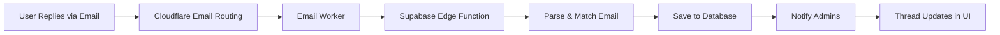

# Contact Form System Documentation

## Overview
The contact form system provides a comprehensive solution for managing user inquiries, bug reports, and feature requests with full conversation threading capabilities.

## Database Schema

### contact_form_settings
- `id` - UUID primary key
- `is_enabled` - Boolean (show/hide form)
- `title` - Text (form heading)
- `description` - Text (form subheading)
- `recipient_email` - Text (where notifications are sent)
- `reply_from_email` - Text (email address replies come from)
- `reply_from_name` - Text (sender name for replies)
- `success_message` - Text (shown after submission)
- `created_at`, `updated_at` - Timestamps

### contact_form_submissions
- `id` - UUID primary key
- `name` - Text (required)
- `email` - Text (required)
- `subject` - Text (optional)
- `message` - Text (required)
- `message_type` - Text (general | bug_report | feature_request)
- `image_url` - Text (optional attachment)
- `status` - Text (new | read)
- `replied_at` - Timestamp (first reply time)
- `replied_by` - UUID (admin who first replied)
- `reply_message` - Text (first reply message for backward compatibility)
- `admin_notes` - Text (internal notes)
- `created_at` - Timestamp

### contact_form_replies (NEW - Added 2025-01-14)
**Purpose:** Store threaded conversation history for back-and-forth communication

- `id` - UUID primary key
- `submission_id` - UUID (references contact_form_submissions)
- `sender_type` - Text ('admin' | 'user')
- `sender_id` - UUID (references auth.users, null for user replies)
- `sender_name` - Text
- `sender_email` - Text
- `message` - Text
- `created_at` - Timestamp

**Migration:** Existing replies from `contact_form_submissions.reply_message` were automatically migrated to this table

## Edge Functions

### send-contact-reply
**Purpose:** Send reply email and save to conversation thread

**Input:**
```typescript
{
  submissionId: string (uuid),
  replyMessage: string (1-5000 chars),
  adminNotes?: string (max 1000 chars)
}
```

**Process:**
1. Validate input with Zod schema
2. Verify admin authorization
3. Fetch submission details
4. Get admin profile for signature
5. Build HTML email with app branding
6. Send email via Resend
7. **Save reply to `contact_form_replies` table**
8. Update admin notes if provided
9. Trigger updates submission table (replied_at, status)

**Security:**
- Requires authentication
- Admin/owner role verified
- HTML sanitization for reply message
- Input validation (Zod)

### notify-admin-new-contact
**Purpose:** Send notification email to admin when new submission arrives

**Trigger:** Automatic on contact form submission

## Frontend Components

### ContactForm
**Location:** Site footer (all pages when enabled)

**Features:**
- Auto-loads settings from database
- Client-side validation (Zod)
- Message type selection
- Optional image upload
- Optional subject line
- Graceful email handling

### ContactFormManager
**Location:** Admin > Contact tab

**Features:**
- Settings configuration
- Submissions table with status badges
- **Threaded conversation view**
- Reply composition
- Manual user reply entry
- Admin notes (internal)
- Status management (new/read)
- Email quick actions

## Conversation Threading System

### View Dialog
**Shows:**
1. **Original Message** - User's initial submission with blue accent
2. **Conversation Thread** - All replies in chronological order:
   - Admin replies: Green background, green border
   - User replies: Blue background, blue border
   - Each shows: sender name, type badge, timestamp, message
3. **Admin Notes** - Internal notes in amber box
4. **Actions:**
   - "Reply" - Compose new reply (clears related notifications on open)
   - "Mark Unread" - Change status

### Reply Dialog
**Shows:**
1. **Conversation Context** - Full thread history with original message
2. **Compose Area** - Text area for new reply
3. **Admin Notes** - Optional internal notes field
4. **Actions:**
   - "Send Reply" - Email and save to thread (updates replied_at timestamp)
   - "Cancel" - Close without sending

### Automatic Email Reply Capture
With CloudFlare Email Routing configured (see CLOUDFLARE_EMAIL_ROUTING_SETUP.md):
- User replies via email automatically appear in conversation thread
- No manual entry needed
- Notifications sent to admins for new replies
- Real-time updates in admin dashboard
- **System email filtering:** Prevents duplicate submissions from system notification emails
  - Filters out emails from `@bestdayministries.org` and `@send.bestdayministries.org`
  - Prevents notification emails from being logged as new submissions

## Performance Optimizations

### Single Query Pattern (Added 2025-10-15)
**Problem:** Original implementation made N individual database queries to count replies for each submission, causing timeout errors when deleting multiple submissions (100+ queries).

**Solution:** Implemented single-query pattern with client-side filtering.

**Before:**
```typescript
// Made 100+ individual queries!
for (const submission of submissions) {
  const { count } = await supabase
    .from("contact_form_replies")
    .select("*", { count: 'exact' })
    .eq("submission_id", submission.id);
}
```

**After:**
```typescript
// Single query fetches ALL replies at once
const { data: allReplies } = await supabase
  .from("contact_form_replies")
  .select("submission_id, sender_type, created_at")
  .in("submission_id", submissionIds);

// Count client-side using JavaScript
submissions.forEach(submission => {
  const count = allReplies?.filter(
    r => r.submission_id === submission.id
  ).length;
});
```

**Benefits:**
- **2-3 queries total** instead of 100+
- Eliminates connection timeout errors
- Real-time safe (efficient enough to run on every update)
- Better scalability (no N+1 query problem)

**Files Updated:**
- `src/components/admin/ContactFormManager.tsx` - loadSubmissions function
- `src/hooks/useContactFormCount.ts` - fetchCount function

## UI Patterns

### Thread Message Styling
```typescript
// User messages (original + incoming)
bg-blue-50 border-l-4 border-blue-500

// Admin messages (outgoing replies)
bg-green-50 border-l-4 border-green-500

// Original submission
bg-muted border-l-4 border-primary
```

### Status Badges
- **New** - Blue badge, red dot indicator
- **Read** - Gray badge
- **Replied** - Green checkmark indicator

### Button States
- Button shows "Continue Conversation" after first reply
- Opens reply dialog with full thread context
- No longer disabled after first reply

## RLS Policies

### contact_form_submissions
- **INSERT:** Anyone (including anonymous) can submit
- **SELECT:** Admins/owners only
- **UPDATE:** Admins/owners only

### contact_form_replies
- **INSERT:** Admins/owners only
- **SELECT:** Admins/owners only

### contact_form_settings
- **SELECT:** Public can read if enabled
- **UPDATE:** Admins/owners only

## Database Triggers

### update_submission_on_first_reply()
**Trigger:** After INSERT on contact_form_replies

**Purpose:** Maintain backward compatibility with submissions table

**Logic:**
- When first admin reply is added to thread
- Updates `contact_form_submissions`:
  - `replied_at` - Set to reply timestamp
  - `replied_by` - Set to admin user ID
  - `reply_message` - Copy of first reply message
  - `status` - Set to 'read'

## Workflow Examples

### Simple Reply (First Response)
1. User submits form → Creates submission record + notifies admins
2. Admin sees notification badge in header and Contact tab
3. Admin clicks "Reply" → Notifications cleared, dialog opens
4. Admin types reply and sends → Email sent + saved to replies table
5. Trigger updates submission table with first reply info (replied_at timestamp)
6. Submission shows "Continue Conversation" button

### Ongoing Conversation (with CloudFlare)
1. User replies via email → CloudFlare routes to edge function
2. Edge function saves reply to database + notifies admins
3. Admin sees notification badge increment + red dot on submission row
4. Admin opens submission → Badge on "Reply" button shows unread count
5. Admin clicks "Reply" → All notifications cleared, dialog opens with full thread
6. Admin composes response with full context → Sends
7. New admin reply saved + email sent + replied_at updated
8. User receives email and can reply again

### Multiple Back-and-Forth
- Thread displays all messages chronologically
- Color coding distinguishes admin vs user
- Full context always visible when replying
- No limit on conversation length
- Notifications only for new user replies (not admin replies)
- Red dot appears on submission when user replies
- Cleared when admin opens reply dialog

## Email Configuration

### Resend Setup
1. Sign up at https://resend.com
2. Add and verify domain (SPF, DKIM records)
3. Create API key
4. Add `RESEND_API_KEY` to secrets
5. Update `reply_from_email` in settings

### Email Template Features
- App logo in header (from app_settings)
- Professional formatting
- Original message quoted
- Admin signature
- Reply-to header set to admin email

## Integration Points

### Notification System
**New Submission Notifications:**
- Admins receive notification on new submission
- Type: `contact_form_submission`
- Badge counter increments in admin header and Contact tab
- Notification created when email arrives via CloudFlare routing

**User Reply Notifications:**
- Admins receive notification when user replies via email
- Type: `contact_form_reply`
- Badge counter increments for both new submissions AND new replies
- Red dot indicator on submission row in admin table
- Badge on "Reply" button shows count of unread user replies

**Notification Clearing:**
- Opening reply dialog marks all related notifications as read
- Includes both submission and reply notifications for that thread
- Badge counters update in real-time via Supabase subscriptions

**Badge Counter Logic:**
```typescript
// Counts both:
// 1. New submissions (status === 'new')
// 2. Submissions with unread user replies (replied_at < latest_user_reply.created_at)
const totalCount = newSubmissionsCount + submissionsWithUnreadRepliesCount;
```

### Admin Dashboard
- Contact tab with badge counter (submissions + unread replies)
- Badge also appears in header navigation
- Settings + Submissions in single view
- Quick actions in table rows
- Visual indicators:
  - Red dot: New submission OR unread user replies
  - Red badge on "Reply" button: Count of unread replies

## Email Reply Handling

### Automatic Email Reply Capture (Recommended - FREE with CloudFlare)

**Why Cloudflare Email Routing?**
- ✅ **FREE** - No monthly cost
- ✅ Full email threading with nonprofit domain
- ✅ Automatic reply capture
- ✅ Professional appearance
- ✅ Easy setup (15 minutes)

**Complete Setup Guide:**

### Step 1: Set Up Cloudflare Email Routing

1. **Add your domain to Cloudflare** (if not already)
   - Go to [dash.cloudflare.com](https://dash.cloudflare.com)
   - Click "Add a Site"
   - Enter your nonprofit domain
   - Follow DNS migration steps

2. **Enable Email Routing**
   - Navigate to Email → Email Routing
   - Click "Enable Email Routing"
   - Add MX records (Cloudflare provides these):
     ```
     Priority: 1  |  Name: @  |  Value: route1.mx.cloudflare.net
     Priority: 2  |  Name: @  |  Value: route2.mx.cloudflare.net
     Priority: 3  |  Name: @  |  Value: route3.mx.cloudflare.net
     ```

3. **Verify DNS Records**
   - Wait 5-10 minutes for DNS propagation
   - Cloudflare will verify automatically

### Step 2: Create Cloudflare Email Worker

1. **Navigate to Workers & Pages**
   - In Cloudflare Dashboard
   - Click "Create Application"
   - Select "Create Worker"
   - Name it: `email-processor`

2. **Add Worker Code**
   ```javascript
   export default {
     async email(message, env, ctx) {
       try {
         // Extract email content
         const rawText = await new Response(message.raw).text();
         
         // Forward to Supabase edge function
         const response = await fetch(
           'https://nbvijawmjkycyweioglk.supabase.co/functions/v1/process-inbound-email',
           {
             method: 'POST',
             headers: {
               'Content-Type': 'application/json',
             },
             body: JSON.stringify({
               from: message.from,
               to: message.to,
               subject: message.headers.get('subject') || '',
               text: rawText,
               raw: rawText,
             }),
           }
         );
         
         console.log('Forwarded to edge function:', response.status);
       } catch (error) {
         console.error('Error processing email:', error);
       }
     }
   };
   ```

3. **Deploy Worker**
   - Click "Save and Deploy"

### Step 3: Configure Email Routing Rules

1. **Add Routing Rule**
   - Go back to Email → Email Routing
   - Click "Routing Rules"
   - Click "Create Address"

2. **Create contact@ address**
   - Destination address: `contact@yournonprofit.org`
   - Action: "Send to a Worker"
   - Select your `email-processor` worker
   - Click "Save"

### Step 4: Update Contact Form Settings

1. **In your app, go to Admin > Contact**
2. **Update these settings:**
   - Reply From Email: `contact@yournonprofit.org`
   - Reply From Name: `Your Nonprofit Name`
3. **Save settings**

### Step 5: Verify Resend Domain

1. **Go to [resend.com/domains](https://resend.com/domains)**
2. **Add your nonprofit domain** (if not already)
3. **Add DNS records** provided by Resend:
   - SPF record
   - DKIM records (2-3 records)
4. **Wait for verification** (5-30 minutes)

### Step 6: Test the Full Flow

1. **Submit test contact form** from a personal email
2. **Reply from Admin panel** - email sent via Resend
3. **Check your personal email** - should receive reply from `contact@yournonprofit.org`
4. **Reply to that email** - should go to Cloudflare
5. **Check Admin > Contact** - reply should appear automatically in thread! ✅

### Troubleshooting

**Email not received by Cloudflare:**
- Check MX records are set correctly
- Wait 30 minutes for DNS propagation
- Test with Cloudflare's email routing test tool

**Worker not triggering:**
- Check Worker logs in Cloudflare dashboard
- Ensure routing rule points to correct worker
- Verify worker is deployed

**Reply not appearing in thread:**
- Check edge function logs: Admin > Backend > Functions > process-inbound-email
- Verify sender email matches original submission
- Check that submission exists in database

**Resend not sending:**
- Verify domain is verified in Resend
- Check SPF/DKIM records are correct
- Review Resend API logs

### How It Works



**Edge Function Features:**
- Email parsing (removes quotes, signatures)
- Sender matching to original submission
- Automatic threading
- Admin notifications
- Content sanitization
- Handles both Cloudflare and standard formats
- **System email filtering:** Ignores emails from system domains to prevent duplicate submissions

### Potential Additional Features
- Rich text editor for admin replies
- File attachments in replies
- Canned response templates
- Search and filter conversation history
- Export conversation as PDF
- Webhook signature verification (optional security layer)

## Testing

### Manual Testing Steps
1. Submit contact form as user
2. Verify admin receives notification
3. Reply from admin panel
4. Check email received correctly
5. Add manual user reply
6. Send another admin reply
7. Verify full thread displays correctly

### E2E Tests (TODO)
- Contact form submission
- Admin reply sending
- Thread display verification
- Manual user reply addition
- Multiple back-and-forth messages

## Troubleshooting

### Email Not Sending
- Verify RESEND_API_KEY is set
- Check domain is verified in Resend
- Review SPF/DKIM records
- Check edge function logs

### Replies Not Appearing in Thread
- Verify RLS policies allow admin access
- Check edge function saved to replies table
- Reload submissions list
- Check browser console for errors

### User Reply Not Added
- Verify admin role
- Check RLS policy on insert
- Ensure message is not empty
- Review database logs

### Automatic Replies Not Working
- Verify Resend inbound email is configured
- Check webhook URL is correct
- Review edge function logs
- Confirm sender email matches original submission
- Test webhook manually with sample payload

## Related Documentation
- [NOTIFICATION_SYSTEM_COMPLETE.md](./NOTIFICATION_SYSTEM_COMPLETE.md) - Admin notifications
- [ADMIN_DASHBOARD_CONCISE.md](./ADMIN_DASHBOARD_CONCISE.md) - Admin panel structure
- [EMAIL_TESTING_PRODUCTION_PARITY.md](./EMAIL_TESTING_PRODUCTION_PARITY.md) - Email testing with database verification
- [CLOUDFLARE_EMAIL_ROUTING_SETUP.md](./CLOUDFLARE_EMAIL_ROUTING_SETUP.md) - CloudFlare email routing setup
- [CONTACT_FORM_NOTIFICATIONS.md](./CONTACT_FORM_NOTIFICATIONS.md) - Notification system integration
