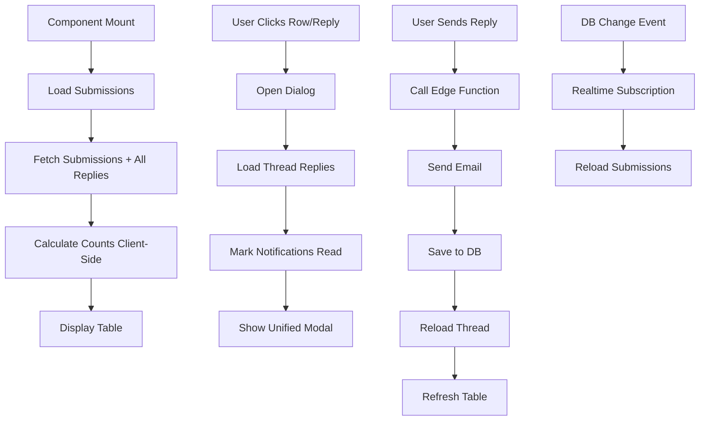

# Contact Submissions UI Implementation Guide

## Overview

This document provides a comprehensive guide to the ContactSubmissions component, focusing on the unified modal pattern and UI/UX design decisions made on November 4, 2025.

## Design Philosophy

### Unified Experience
**Problem:** Original design had separate "View" and "Reply" dialogs, forcing users to:
- Switch between modals to see message and compose reply
- Lose context when transitioning
- Remember information from one modal to use in another
- Make extra clicks to perform common workflow

**Solution:** Single unified conversation modal that combines:
- Message viewing
- Conversation history
- Reply composition
- Admin notes management

**Benefits:**
- ✅ Reduced cognitive load (one modal vs. two)
- ✅ Context always visible (message + compose reply together)
- ✅ Fewer clicks (2→1 for view+reply workflow)
- ✅ Better for threaded conversations
- ✅ Consistent with modern email clients (Gmail, Outlook)

### Action Hierarchy
**Primary Action:** Reply button
- Most common user action
- Always visible in table
- Shows state (unread count badge)
- Opens unified modal

**Secondary Actions:** More dropdown
- Less frequent operations
- Keeps interface clean
- Mobile-friendly

## Component Architecture

### File Structure
```
src/components/admin/
  └── ContactSubmissions.tsx (single file, ~420 lines)
```

**Why single file?**
- Tightly coupled state (submissions + replies + modal)
- Shared realtime subscriptions
- Performance optimization (single query pattern)
- Easier to maintain related functionality together

### State Management

**Data State:**
```typescript
const [submissions, setSubmissions] = useState<Submission[]>([]);
const [replies, setReplies] = useState<Reply[]>([]);
```

**UI State:**
```typescript
// Single dialog state (unified modal)
const [dialogOpen, setDialogOpen] = useState(false);
const [selectedSubmission, setSelectedSubmission] = useState<Submission | null>(null);

// Form state
const [replyMessage, setReplyMessage] = useState("");
const [adminNotes, setAdminNotes] = useState("");

// Loading states
const [loading, setLoading] = useState(true);
const [loadingReplies, setLoadingReplies] = useState(false);
const [sending, setSending] = useState(false);
```

**Selection State:**
```typescript
// Bulk operations
const [selectedIds, setSelectedIds] = useState<Set<string>>(new Set());
const [bulkProcessing, setBulkProcessing] = useState(false);
```

### Data Flow



## UI Components

### Table Layout

**Column Structure:**
```
┌─────────────────────────────────────────────────────────────────────┐
│ [✓] [•] Date    Name      Subject     Type    Src  Status  Actions  │
├─────────────────────────────────────────────────────────────────────┤
│ [✓] [•] 11/4/25 John Doe  Bug report  bug     📧   new     [Reply] […]│
│ [ ] [ ] 11/3/25 Jane S... Feature...  feature 🌐   read    [Reply] […]│
└─────────────────────────────────────────────────────────────────────┘
```

**Column Details:**

1. **Checkbox** (w-12)
   - Bulk selection
   - "Select all" in header
   - Stop propagation on click

2. **Status Indicator** (w-12)
   - Red dot if new OR unread replies
   - 8px circle (w-2 h-2)
   - bg-red-500

3. **Date** (auto)
   - Format: "M/d/yy" (e.g., "11/4/25")
   - Shortest readable format
   - Saves ~8 characters vs "MMM d, yyyy"

4. **Name** (auto)
   - Sender's display name
   - No truncation (wraps if needed)

5. **Subject** (auto)
   - Max-width: 200px
   - Text truncated with ellipsis
   - Full text on hover (title attribute)
   - Shows "No subject" (muted, italic) if empty

6. **Type** (auto)
   - Badge with outline variant
   - Replaces underscores with spaces
   - Examples: "general", "bug report", "feature request"

7. **Source** (auto)
   - Icon only (Mail or Globe)
   - Tooltip on hover
   - Mail = email routing, Globe = web form

8. **Status** (auto)
   - Badge: "new" (primary) or "read" (secondary)

9. **Actions** (auto)
   - Reply button (always visible)
   - More dropdown (three dots)

### Action Buttons

**Reply Button:**
```tsx
<TooltipProvider>
  <Tooltip>
    <TooltipTrigger asChild>
      <Button size="sm" variant="ghost" onClick={openDialog}>
        <Reply className="w-4 h-4" />
        {unreadCount > 0 && (
          <Badge variant="destructive" className="ml-1">
            {unreadCount}
          </Badge>
        )}
      </Button>
    </TooltipTrigger>
    <TooltipContent>View and reply</TooltipContent>
  </Tooltip>
</TooltipProvider>
```

**More Dropdown:**
```tsx
<DropdownMenu>
  <DropdownMenuTrigger asChild>
    <Button size="sm" variant="ghost">
      <MoreVertical className="w-4 h-4" />
    </Button>
  </DropdownMenuTrigger>
  <DropdownMenuContent align="end">
    <DropdownMenuItem onClick={openDialog}>
      <Eye className="w-4 h-4 mr-2" />
      View Message
    </DropdownMenuItem>
    <DropdownMenuItem onClick={toggleStatus}>
      {isNew ? <MailOpen /> : <Mail />} className="w-4 h-4 mr-2" />
      Mark as {isNew ? 'Read' : 'Unread'}
    </DropdownMenuItem>
    <DropdownMenuItem onClick={deleteSubmission} className="text-destructive">
      <Trash2 className="w-4 h-4 mr-2" />
      Delete
    </DropdownMenuItem>
  </DropdownMenuContent>
</DropdownMenu>
```

### Unified Conversation Modal

**Structure:**
```tsx
<Dialog open={dialogOpen} onOpenChange={setDialogOpen}>
  <DialogContent className="max-w-3xl max-h-[90vh] flex flex-col">
    <DialogHeader>
      <DialogTitle>Message from {name}</DialogTitle>
      <DialogDescription>{email}</DialogDescription>
    </DialogHeader>
    
    <div className="space-y-6 overflow-y-auto flex-1 pr-2">
      {/* Section A: Original Message */}
      <div className="space-y-3 p-4 bg-muted/50 rounded-lg">
        {/* Date + Status */}
        {/* Subject (if present) */}
        {/* Message text */}
        {/* Image (if present) */}
      </div>
      
      {/* Section B: Conversation History */}
      {replies.length > 0 && (
        <div className="space-y-3">
          <h3>Conversation History</h3>
          <div className="space-y-2 max-h-60 overflow-y-auto">
            {replies.map(reply => (
              <div className={senderType === 'admin' ? 'ml-8' : 'mr-8'}>
                {/* Reply content */}
              </div>
            ))}
          </div>
        </div>
      )}
      
      {/* Section C: Reply Form */}
      <div className="space-y-3 pt-4 border-t">
        <h3>Send Reply</h3>
        <Textarea placeholder="Type your reply..." />
        <Textarea placeholder="Admin notes (internal only)..." />
        <Button onClick={sendReply}>
          <Reply className="mr-2" />
          Send Reply
        </Button>
      </div>
    </div>
  </DialogContent>
</Dialog>
```

**Layout Strategy:**
- **max-w-3xl** - Wide enough for content, not overwhelming
- **max-h-[90vh]** - Leaves space for OS chrome
- **flex flex-col** - Header fixed, content scrolls
- **overflow-y-auto** - Scrollbar on content area only
- **pr-2** - Padding for scrollbar (prevents content shift)

**Section Spacing:**
- **space-y-6** - Generous spacing between sections
- **space-y-3** - Comfortable spacing within sections
- **space-y-2** - Tight spacing for list items

### Conversation Threading

**Original Message Box:**
```tsx
<div className="space-y-3 p-4 bg-muted/50 rounded-lg">
  {/* Metadata row */}
  <div className="flex items-center justify-between">
    <div className="text-sm text-muted-foreground">
      {format(created_at, 'PPpp')}
    </div>
    <Badge variant={status === 'new' ? 'default' : 'secondary'}>
      {status}
    </Badge>
  </div>
  
  {/* Subject (optional) */}
  {subject && (
    <div>
      <strong>Subject:</strong> {subject}
    </div>
  )}
  
  {/* Message */}
  <div>
    <strong>Message:</strong>
    <p className="whitespace-pre-wrap mt-2 p-3 bg-background rounded">
      {message}
    </p>
  </div>
  
  {/* Image (optional) */}
  {image_url && (
    <div>
      <strong>Attachment:</strong>
      
    </div>
  )}
</div>
```

**Reply Styling:**
```tsx
{replies.map((reply) => (
  <div 
    key={reply.id} 
    className={`p-3 rounded ${
      reply.sender_type === 'admin' 
        ? 'bg-primary/10 ml-8'  // Admin: tinted, right indent
        : 'bg-muted mr-8'        // User: muted, left indent
    }`}
  >
    <div className="text-sm font-medium">
      {reply.sender_name} ({reply.sender_type})
    </div>
    <div className="text-xs text-muted-foreground">
      {format(reply.created_at, 'PPp')}
    </div>
    <p className="mt-1 whitespace-pre-wrap">
      {reply.message}
    </p>
  </div>
))}
```

**Design Rationale:**
- **Indentation** - Visual hierarchy (admin right, user left)
- **Background colors** - Distinguish sender types at a glance
- **No borders** - Cleaner look, color is sufficient
- **Whitespace preservation** - Maintains formatting from textarea
- **Metadata first** - Name and time before content
- **Type badge** - Explicit sender type indicator

### Reply Form

**Textarea Configuration:**
```tsx
<Textarea 
  value={replyMessage} 
  onChange={(e) => setReplyMessage(e.target.value)} 
  placeholder="Type your reply..." 
  rows={6}  // Comfortable height for most replies
/>

<Textarea 
  value={adminNotes} 
  onChange={(e) => setAdminNotes(e.target.value)} 
  placeholder="Admin notes (internal only)..." 
  rows={3}  // Smaller, less prominent
/>
```

**Send Button:**
```tsx
<Button 
  onClick={sendReply} 
  disabled={sending || !replyMessage.trim()}
>
  {sending ? (
    <>
      <Loader2 className="mr-2 h-4 w-4 animate-spin" />
      Sending...
    </>
  ) : (
    <>
      <Reply className="mr-2 h-4 w-4" />
      Send Reply
    </>
  )}
</Button>
```

**Form Behavior:**
- Reply message required (button disabled if empty)
- Admin notes optional (not sent to user)
- Button disabled during send (prevents double-submit)
- Loading spinner + text change during send
- Form does NOT clear after send (stays open, clears message only)
- User can send multiple replies without closing modal

## Data Fetching Strategy

### Single Query Pattern

**Problem:**
Original implementation made N individual queries:
```typescript
// ❌ BAD: 100+ queries for 50 submissions
for (const submission of submissions) {
  const { count } = await supabase
    .from("contact_form_replies")
    .select("*", { count: 'exact' })
    .eq("submission_id", submission.id);
}
```

**Solution:**
Fetch all replies once, count client-side:
```typescript
// ✅ GOOD: 2-3 queries total
const submissionIds = data.map(s => s.id);

const { data: allReplies } = await supabase
  .from("contact_form_replies")
  .select("submission_id, sender_type, created_at")
  .in("submission_id", submissionIds);

// Count client-side with Map
const replyCounts = new Map<string, { total: number; unread: number }>();

data.forEach(submission => {
  const submissionReplies = allReplies?.filter(
    r => r.submission_id === submission.id
  ) || [];
  
  const repliedAt = submission.replied_at || "1970-01-01";
  const unreadUserReplies = submissionReplies.filter(
    r => r.sender_type === "user" && r.created_at >= repliedAt
  ).length;
  
  replyCounts.set(submission.id, {
    total: submissionReplies.length,
    unread: unreadUserReplies
  });
});
```

**Benefits:**
- 2-3 queries instead of 100+
- No connection timeout errors
- Real-time subscription friendly
- Scales to thousands of submissions

### Realtime Updates

**Subscription Pattern:**
```typescript
useEffect(() => {
  loadSubmissions();
  
  // Subscribe to both tables
  const submissionsChannel = supabase
    .channel('contact_submissions')
    .on('postgres_changes', {
      event: '*',
      schema: 'public',
      table: 'contact_form_submissions'
    }, () => {
      loadSubmissions();  // Reload on any change
    })
    .subscribe();
  
  const repliesChannel = supabase
    .channel('contact_replies')
    .on('postgres_changes', {
      event: '*',
      schema: 'public',
      table: 'contact_form_replies'
    }, () => {
      loadSubmissions();  // Reload on any change
    })
    .subscribe();
  
  // Cleanup
  return () => {
    supabase.removeChannel(submissionsChannel);
    supabase.removeChannel(repliesChannel);
  };
}, []);
```

**Why reload on replies changes?**
- Reply counts need updating
- Unread counts need recalculating
- Status indicators need refreshing
- Single query pattern makes this efficient

## User Workflows

### Quick Reply Workflow
1. User sees red dot on submission row
2. Clicks Reply button
3. Modal opens with full message + history
4. Types reply in textarea
5. Clicks Send Reply
6. Email sent, message cleared, thread updated
7. Can send another reply or close modal

**Total clicks:** 2 (Reply → Send)

### Bulk Status Change Workflow
1. User selects multiple checkboxes
2. Bulk actions bar appears
3. Clicks "Mark as Read"
4. All selected updated, selection cleared
5. Toast shows count

**Total clicks:** 2-3 (Select → Mark)

### Delete Workflow
1. User clicks More dropdown (three dots)
2. Clicks Delete (red text)
3. Submission removed, table refreshes
4. Toast confirms deletion

**Total clicks:** 2 (More → Delete)

## Accessibility Features

### Keyboard Navigation
- Tab through table rows and buttons
- Enter to open modal
- Escape to close modal
- Arrow keys in dropdowns
- Tab through form fields

### Screen Reader Support
- Descriptive button labels via tooltips
- ARIA labels on all interactive elements
- Dialog title and description
- Status indicators announced
- Loading states announced

### Focus Management
- Focus trap in modal
- Returns focus to trigger button on close
- Clear focus indicators (outline)
- Skip to main content link

## Performance Optimizations

### Database Queries
- ✅ Single query for reply counts (not N queries)
- ✅ Limit submissions to 50 most recent
- ✅ Select only needed columns
- ✅ Indexed foreign keys
- ✅ Efficient RLS policies

### React Rendering
- ✅ useState for local state
- ✅ No unnecessary re-renders
- ✅ Event handlers memoized implicitly
- ✅ Conditional rendering for empty states
- ✅ Loading states prevent double-fetches

### Network Optimization
- ✅ Realtime subscriptions (not polling)
- ✅ Batch operations (bulk actions)
- ✅ Optimistic UI updates (status changes)
- ✅ Debounced refreshes
- ✅ Lazy loading (replies only when needed)

## Testing Checklist

### Functional Testing
- [ ] Submit contact form, verify appears in table
- [ ] Click Reply button, modal opens
- [ ] Send reply, email delivered and saved
- [ ] Mark as read/unread, status updates
- [ ] Delete submission, removed from table
- [ ] Bulk select and mark as read
- [ ] Bulk select and delete (with confirmation)
- [ ] Refresh button reloads data
- [ ] Realtime updates on new submission
- [ ] Realtime updates on new reply

### UI Testing
- [ ] Red dot shows for new submissions
- [ ] Red dot shows for unread replies
- [ ] Badge shows unread count on Reply button
- [ ] Subject truncates at 200px with hover tooltip
- [ ] Date displays in M/d/yy format
- [ ] Source icon shows correct type (mail/globe)
- [ ] Status badge shows correct variant
- [ ] Modal scrolls properly with long content
- [ ] Images display full-size in modal
- [ ] Reply form clears after send
- [ ] Loading spinners appear during operations

### Accessibility Testing
- [ ] Keyboard navigation works
- [ ] Screen reader announces states
- [ ] Focus indicators visible
- [ ] ARIA labels present
- [ ] Color contrast passes WCAG AA
- [ ] Modal focus trap works
- [ ] Escape key closes modal

### Performance Testing
- [ ] Table loads in <2 seconds with 50 submissions
- [ ] No timeout errors with many replies
- [ ] Smooth scrolling in modal
- [ ] No lag when typing in textareas
- [ ] Realtime updates without flicker
- [ ] Bulk operations complete quickly

### Edge Cases
- [ ] Submission with no subject displays "No subject"
- [ ] Submission with very long message scrolls
- [ ] Submission with large image displays properly
- [ ] Empty state when no submissions
- [ ] Loading state during initial fetch
- [ ] Error handling for failed sends
- [ ] Duplicate prevention during send

## Migration Guide

### From Separate Dialogs to Unified Modal

**Before:**
```typescript
const [viewDialogOpen, setViewDialogOpen] = useState(false);
const [replyDialogOpen, setReplyDialogOpen] = useState(false);

// Two separate dialogs in JSX
<Dialog open={viewDialogOpen} onOpenChange={setViewDialogOpen}>
  {/* View content */}
</Dialog>

<Dialog open={replyDialogOpen} onOpenChange={setReplyDialogOpen}>
  {/* Reply content */}
</Dialog>
```

**After:**
```typescript
const [dialogOpen, setDialogOpen] = useState(false);

// Single unified dialog
<Dialog open={dialogOpen} onOpenChange={setDialogOpen}>
  {/* Original message */}
  {/* Conversation history */}
  {/* Reply form */}
</Dialog>
```

**Steps:**
1. Remove `viewDialogOpen` and `replyDialogOpen` states
2. Add single `dialogOpen` state
3. Combine dialog content into single modal
4. Update all button onClick handlers to use `setDialogOpen`
5. Test all workflows still function correctly

## Future Enhancements

### Planned Features
- [ ] Rich text editor for replies (formatting, links)
- [ ] File attachments in replies
- [ ] Canned response templates
- [ ] Search and filter submissions
- [ ] Export conversations as PDF
- [ ] Conversation notes (separate from admin notes)
- [ ] Assignment to specific admins
- [ ] Priority/urgency flags
- [ ] Tags for categorization
- [ ] Email signature templates

### Performance Improvements
- [ ] Virtual scrolling for large lists
- [ ] Infinite scroll instead of pagination
- [ ] Optimistic UI updates for all actions
- [ ] Request deduplication
- [ ] Background sync for offline changes

### UX Enhancements
- [ ] Keyboard shortcuts (R for reply, D for delete, etc.)
- [ ] Drag-to-select multiple rows
- [ ] Smart suggestions for canned responses
- [ ] Typing indicators (if user is composing email reply)
- [ ] Read receipts (when user opens email)

## Troubleshooting

### Modal Won't Open
**Symptom:** Clicking Reply button does nothing

**Check:**
- Console for JavaScript errors
- dialogOpen state updates correctly
- selectedSubmission is set
- No conflicting onClick handlers

**Fix:** Ensure onClick event propagation not stopped elsewhere

### Reply Not Sending
**Symptom:** Click Send Reply, nothing happens

**Check:**
- Reply message not empty
- Edge function deployed
- RESEND_API_KEY configured
- Console for error messages

**Fix:** Check edge function logs in Lovable Cloud backend

### Conversation History Not Loading
**Symptom:** Modal shows original message but no replies

**Check:**
- loadReplies() called on modal open
- Replies table has records
- RLS policies allow admin to SELECT
- Console for database errors

**Fix:** Verify RLS policies and check network tab

### Red Dot Incorrect
**Symptom:** Red dot shows when no unread replies

**Check:**
- replied_at timestamp correct
- User replies have sender_type='user'
- Client-side count logic
- Realtime subscriptions working

**Fix:** Debug loadSubmissions() count calculation

## Related Documentation

- [CONTACT_FORM_SYSTEM.md](./CONTACT_FORM_SYSTEM.md) - Full system documentation
- [CONTACT_FORM_NOTIFICATIONS.md](./CONTACT_FORM_NOTIFICATIONS.md) - Notification system
- [CLOUDFLARE_EMAIL_ROUTING_SETUP.md](./CLOUDFLARE_EMAIL_ROUTING_SETUP.md) - Email integration
- [ADMIN_DASHBOARD_CONCISE.md](./ADMIN_DASHBOARD_CONCISE.md) - Admin interface overview

---

**Last Updated:** November 4, 2025  
**Maintainer:** AI Assistant  
**Status:** Production
